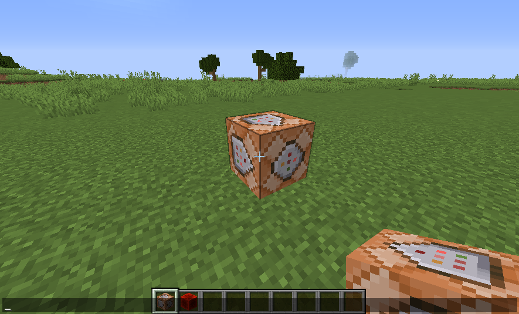
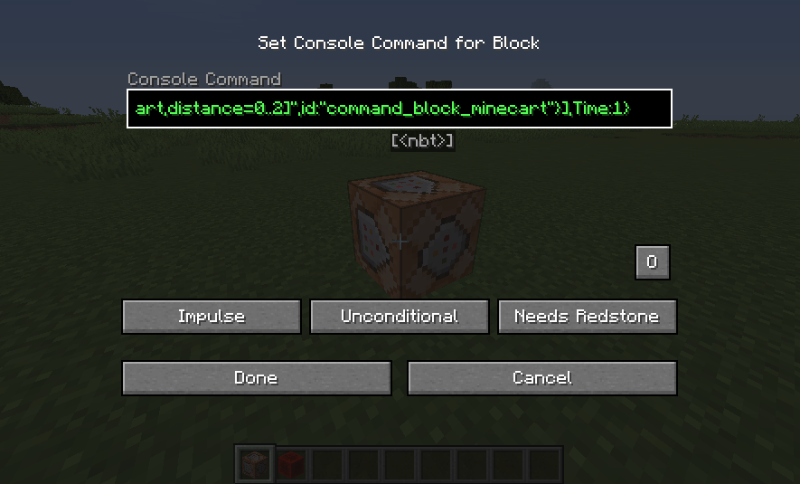
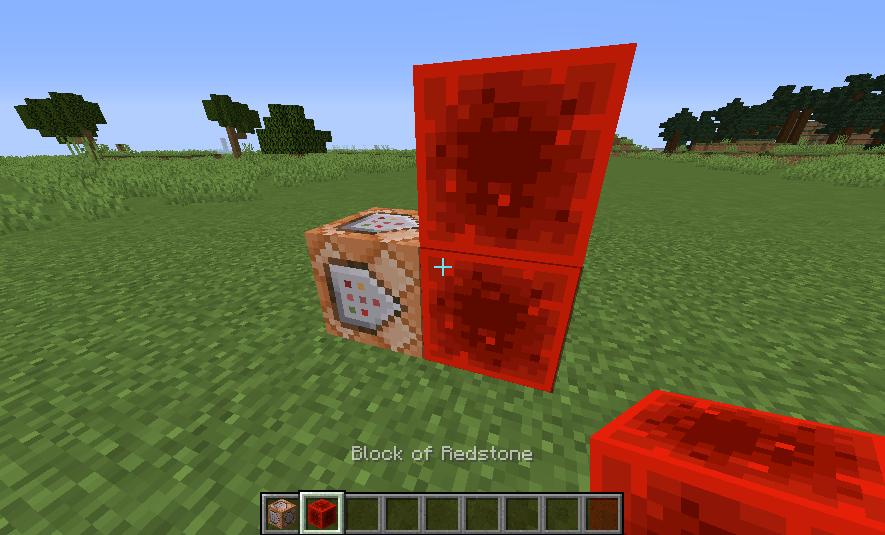
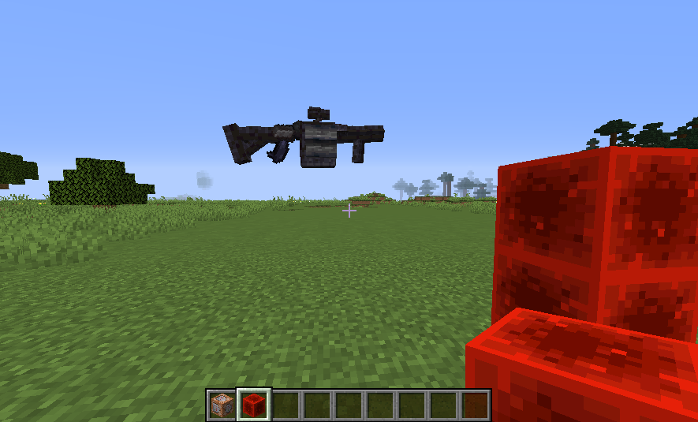

# What is this?
Inside this repository you will find different armor-stand projects. These can be loaded and imported into your world if you wish.

Each project has an additional file named simmelar to the project's main file but with an .info extension. These files contain informations about the project and it's author.

# How to use

Grab yourself a command- and a redstone-block ingame.

Place the command block.

Insert the command that you got from the project-file:
`Projectname.txt`.

Place two redstone-blocks next to the command-block and on top of each other.

Now the project should be loaded into your world.

If the project consists of more that one command, repeat all steps for all files.
These file usually are called something like: `Projectname-1.txt`, `Projectname-2.txt`.

# Addition information
If you yourself have a cool armor-stand project, message me eighter viva email `toolsmod@pm.me` or create an issue with a world-download. I will then convert your project into a "Only-One-(or multiple)-Command" project and put it into this repository. Be sure to know, that everyone will be able to download it.
